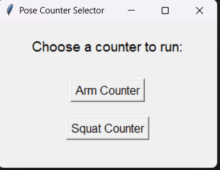
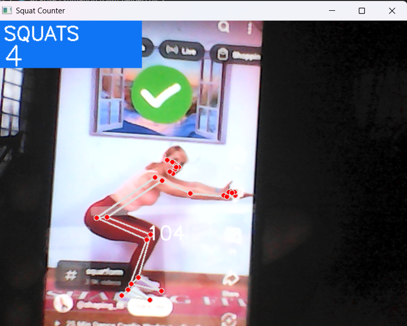

# 💪 AI Gym Assistant

The **AI Gym Assistant** is a computer vision-based fitness tool that helps users monitor and count exercise repetitions in real time. Utilizing the webcam and AI-powered pose estimation, it tracks user movement during arm curls and squats, providing immediate visual feedback and a counter for each exercise.

---

## 📝 Project Description

This project uses MediaPipe's pose detection and OpenCV to analyze body posture from webcam input. It calculates joint angles to identify exercise stages and automatically counts reps. A simple GUI built with Tkinter allows users to choose between tracking **arm curls** or **squats**.

This assistant is ideal for users who want to train at home and track their form and progress without the need for gym equipment or personal trainers.

---

## 🧠 Features

- Real-time video processing with angle calculation
- Repetition counting for:
  - **Arm curls**
  - **Squats**
- GUI for easy exercise selection
- Visual landmarks and feedback on screen
- Threading support to keep GUI responsive

---

## 🛠️ Technologies Used

- **Python 3**
- **OpenCV** – for real-time video capture and rendering
- **MediaPipe** – for pose detection and landmark tracking
- **NumPy** – for numerical calculations (e.g., angle detection)
- **Tkinter** – for GUI interface
- **Threading** – to handle concurrent video capture and GUI interaction

---

## 📸 Screenshots

### 🧭 GUI Window

### 💪 Arm Counter Mode

### 🏋️ Squat Counter Mode

